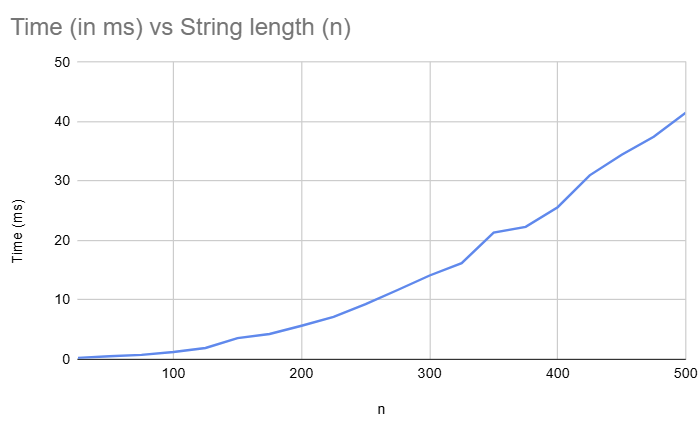
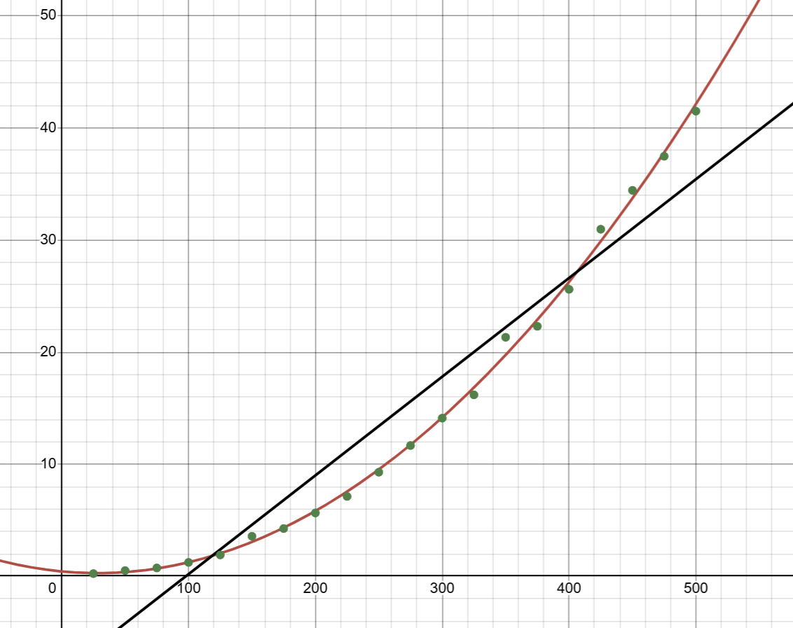

Names: Luke Gorman and Jeevan Iyadurai

UFIDs: 43500015 and 31691151

To compile:

in the main folder of the project, run

g++ -std=c++20 -o out/hvlcs src/hvlcs.cpp

To run:

in the out folder of the project, run

out [input file path]

ex. 

out ../inputs/test1.txt

Assumptions are as stated in the assignment specifications.

Problem 1:

Problem 2:
dp[i][j] = 

	0                                                     if i == 0 || j == 0

	max(dp[i-1][j], dp[i][j-1], dp[i-1][j-1] + val[A[i]]) if A[i] == B[j]

	max(dp[i-1][j], dp[i][j-1])                            if A[i] != B[j]

Here, dp[i][j] represents the best value of the first i chars of A and j chars of B.

Obviously, if we have zero chars of either A or B, the best we can do is zero.

Otherwise, we could choose not to include the character at A[i], in which case it is the same value as dp[i-1][j].

Or, if A[i] and B[j] match, we could include those two characters and add them to the value of the two substrings without those chars, dp[i-1][j-1].

Problem 3:

(Assuming there was a typo in the problem and we should calculate the value)

	int hvlcs(string A, string B, map<char, int> v) { 

		vector<vector<int>> dp = (A.size()+1, vector<int>(B.size()+1, 0));

		for (int i = 1; i < dp.size(); i++) {

			for (int j = 1; j < dp[i].size(); j++) {

				if (A[i+1] == B[j+1]) dp[i][j] = dp[i-1][j-1] + v[A[i+1]];

				dp[i][j] = max(dp[i][j], dp[i-1][j], dp[i][j-1]);

			}

		}

		return dp[A.size()][B.size()];

	}

The time complexity of this algorithm is O(n^2) where n is the length of the longer of strings A and B.

(Calculating the length of the string)

	int hvlcs(string A, string B, map<char, int> v) { 

		vector<vector<pair<int, int>>> dp = (A.size()+1, vector<int>(B.size()+1, pair<int, int>));

		for (int i = 1; i < dp.size(); i++) {

			for (int j = 1; j < dp[i].size(); j++) {

				if (A[i+1] == B[j+1]) dp[i][j] = pair<int, int>(dp[i-1][j-1].first + v[A[i+1]], dp[i-1][j-1].second + 1);

				dp[i][j] = max(dp[i][j], dp[i-1][j], dp[i][j-1]);
			}

		}

		return dp[A.size()][B.size()];

	}

The time complexity of this algorithm is O(n^2) where n is the length of the longer of strings A and B.
